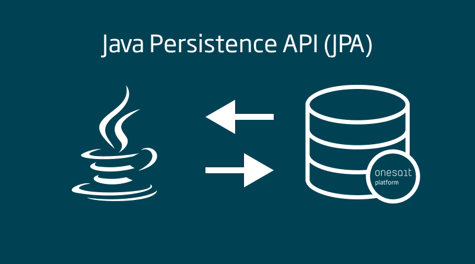
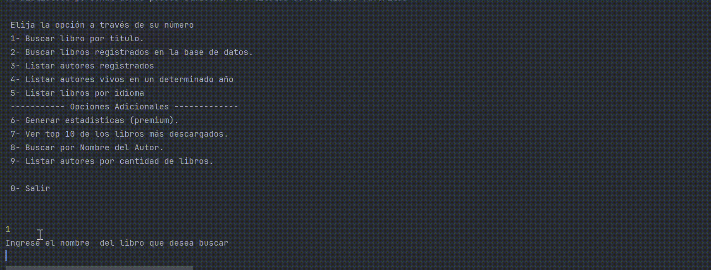

 

# Challenge LiterAlura🌍📕👓

###  🧑‍💻Autor: Juan Palacio.
###   ♾️Para AluraLatam

## Tabla de Contenido
#### 1. [Descripción del proyecto](#descripcion)
#### 2. [Objetivos del proyecto](#objetivos)
#### 3. [Conociendo la interfaz del usuario](#espe)
#### 4. [ Visualizando las respuestas por parte del sistema](#sistema)

### 1. Descripción del proyecto 
Te animas a conocer una nueva aventura literaria, no te gustaría tener tus libros favoritos a tan solo unos clics, 
pues te presento una solución en la que podrás buscar más de 74000 títulos en diferentes idiomas y podrás guardarlos 
en un una base de datos para tenerlos siempre a tu alcance. 

Esta aplicación desarrollada en Java mediante el framework SpringBoot, es la solución al desafío propuesto de por Alura Latam, 
donde se aplicaron los siguientes conocimientos:

* 	Configuración del ambiente de Java ⚙️⌨️.
*	Creación de un proyecto con el Framework Spring 📁🆕.
*	Consumo de una Api ⚙✅️.
*	Análisis de la respuesta por parte de la API en formato JSON.
*	Persistencia de datos en Java 📇.
*	Inserción y consulta en las bases de datos creada en PostgreSQL💾. 
*	Interacción del usuario a través de la consola ⌨️🧑🏻.
*	Exhibición de los resultados a los usuarios 📊.

 

### 2. Objetivos del proyecto 

#### 2.1. Configurar el ambiente Java con Spring.
#### 2.2. Implementar un sistema de solicitudes a una API de consulta de libros.
#### 2.3. Manipular los datos obtenidos de la API en formato JSON.
#### 2.4. Crear las tablas en las bases de datos, relaciones entre entidades gracias a la utilización del Framewrok Spring.
#### 2.5. Utilizar consultas con JPA para recuperar datos insertados en las bases de datos.
#### 2.6. Implementar una interfaz con el usuario.

### 3. Conociendo la interfaz del usuario. 
Al ejecutar la aplicación el usuario encontrara un menú de inicio el cual cuenta con una instrucción básica de como ingresar la opción 
deseada. El cual cuenta con 9 opciones de interacción con el sistema de la aplicación.

#### 1. Opciones de consulta:

1.	**Buscar libro por título:** Esta opción nos permite conectarnos a la API externa para buscar los libros que deseamos guardar en nuestra base de datos. 
Precaución: No se puede guardar dos veces el mismo título, si ye el titulo se encuentra en la base de datos, este no se podrá volver a guardar, el mismo sistema te notificara si intentas hacer esta acción.
2.	**Buscar libros registrados en la base de datos:** En esta opción podemos ver el listado de todos los títulos que tenemos ya guardada en nuestra base de datos.
3.	**Listar autores registrados:** Esta opción nos permite listar los autores de todos los libros de nuestra base de datos.

#### 2. Opciones de filtrado:
4. **Listar autores vivos en un determinado año:** Esta opción nos permite ingresar dos fechas, una fecha de inicio y una fecha final, estas dos fechas nos permite consultar que autores se encuentran vivos dentro de ese rango de fecha.
5. **listar libros por idioma:** Esta opción nos permite ingresar la sigla de un idioma, actualmente en el sistema se pueden filtrar por 4 idiomas:
* es – español.
* en – ingles.
* fr – francés
* pr -portugues.

Después de ingresar una de las anteriores siglas podemos filtrar los libros por uno de estos idiomas.

#### 3. Opciones Extras.

6. **Generar estadísticas:** Si queremos saber la cantidad de libros en nuestras bases de datos, cual es el mas popular, el menos popular, y saber el promedio de descargas. Con esta opción podemos obtener toda esta información con tan solo una consulta.
7. **Ver top 10 de los libros más descargados:** Con esta opción podemos ver el top 10 de los libros más descargados que se encuentra en nuestra base de datos.
8. **Buscar por Nombre del Autor:** Aquí podemos buscar un libro que se encuentra en nuestra base de datos, pero por el nombre del autor, si un autor tiene dos títulos diferentes en nuestras bases de datos, esta opción nos traerá estos dos títulos diferentes.
9.	**Listar autores por cantidad de libros:** Podemos conocer que autor tiene más libros en nuestra biblioteca de libros.
0. **Salir:** Esta opción te hará salir del sistema en el momento que tú lo desees, no te preocupes, los libros que buscaste y guardaste en la base de datos, se quedaran en tu biblioteca personal.

   
### 4. Visualizando las respuestas por parte del sistema. 
Ahora vamos a conocer un poco más del funcionamiento del sistema poniéndolo a prueba.
1. Iniciamos el sistema
2. Supongamos que queremos buscar un libro para guardarlo en un tu almacén personal, el libro que vamos a buscar se llama “El libro del tesoro” escrito por “Robert Louis Stevenson”. Vamos a buscarlo en la Api.

Como podemos observar en la siguiente imagen animada.

Ahora, vamos a probar cinco opciones del menú de usuario para mostrar sus demás funcionalidades:

1. **Ver libros registrados en la base de datos.**
2. **Consultar autores registrados en la base de datos.**
3. **Listar autores vivos en determinado rango de años.**
4. **Listar libros por idiomas.**
5. **Generar estadísticas de la base de datos.**

 

Como podemos observar la aplicación es fácil de usar e intuitiva con el usuario, como te dije al principio Nuestra librería virtual es tu parcera literaria: busca, guarda y disfruta de una colección hecha a tu medida. 
Como te dije antes, con nuestra librería virtual te quitás ese camello de buscar libros por todos lados. Aquí lo tenés todo en un solo lugar: fácil, rápido y a tu medida. ¡Deja el complique y dale una probadita, te va a encantar!"
Gracias.

Copyright © 2024 - Desarrollado por Juan Palacio - para AluraLatam 

